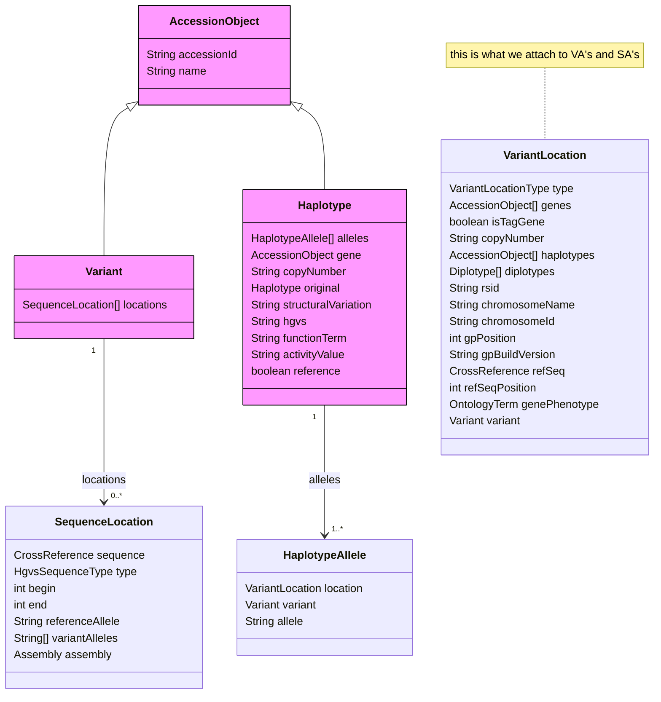
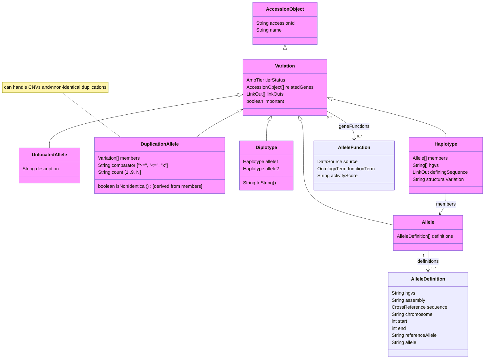

# ClinPGx Variation Data Model

<!--
The last comment block of each slide will be treated as slide notes. It will be visible and editable in Presenter Mode along with the slide. [Read more in the docs](https://sli.dev/guide/syntax.html#notes)
-->

---
transition: slide-left
---

# ClinPGx Background

- Clinical Pharmacogenomics
- https://www.clinpgx.org (formerly pharmgkb.org)
- Notable projects:
    - [CPIC](https://cpicpgx.org)
    - [PharmCAT](https://pharmcat.clinpgx.org)
    - [PharmDOG](https://pharmdog.clinpgx.org)

---
transition: slide-left
---

# Technical Background

- PostgreSQL 15
- Java API (using Jersey & JAX-RS)
- Hibernate ORM
- Website: React SPA / webpack

---
transition: slide-left
---

# How we organize our data

Data structure is defined as Java classes organized in packages, interfaces, etc. 

__Accession Objects__ are entities, for example:
- Gene
- Drug
- Variant
- Haplotype
- Disease

__Annotations__ are links between entities, authored by curators, and linked to a publication/document
- Variant Annotations (VAs)
- Summary Annotations (SAs)

__Supporting Objects__ are things like cross-references, ontology terms, and some genomic location info

---
transition: slide-left
---

### Current Variation Data Model

---
transition: slide-left
---

### New Variation Data Model

