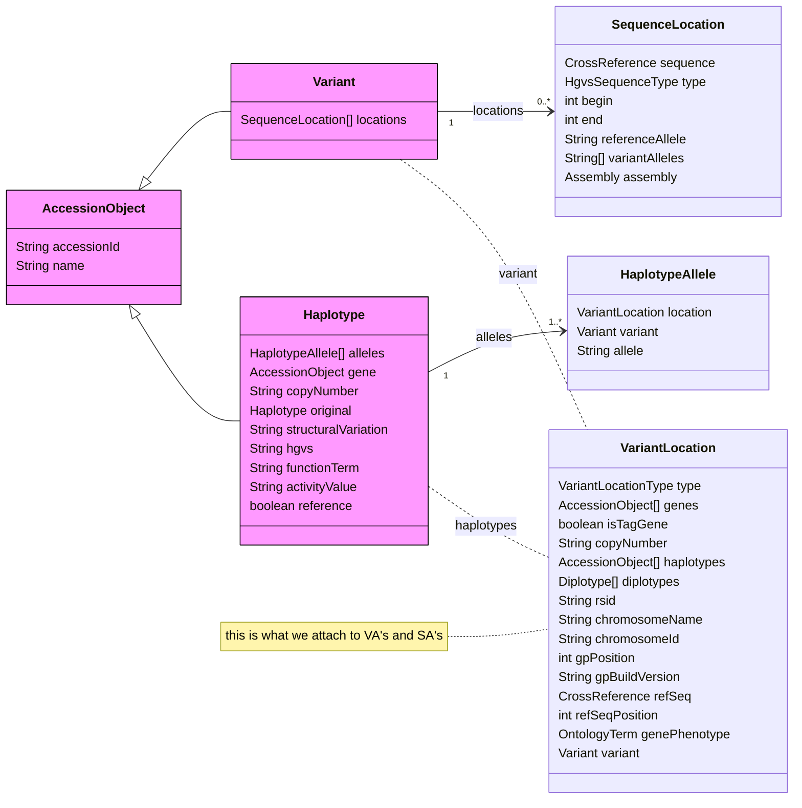
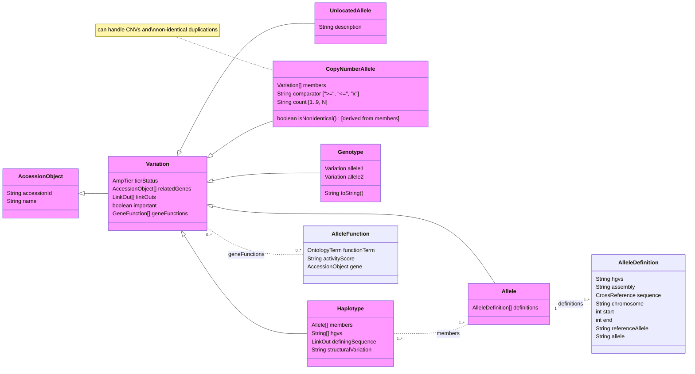

# ClinPGx Variation Data Model

<!--
The last comment block of each slide will be treated as slide notes. It will be visible and editable in Presenter Mode along with the slide. [Read more in the docs](https://sli.dev/guide/syntax.html#notes)
-->

---
transition: slide-left
---

# ClinPGx Background

- Clinical Pharmacogenomics
- https://www.clinpgx.org (formerly pharmgkb.org)
- Notable projects:
    - [CPIC](https://cpicpgx.org)
    - [PharmCAT](https://pharmcat.clinpgx.org)
    - [PharmDOG](https://pharmdog.clinpgx.org)

Our main focus:  
__Annotation of genomic variant & drug relationships in literature, guidelines, drug labels, and other data sets__

---
transition: slide-left
---

# Technical Background

- PostgreSQL 15
- Custom Java Model & API (using Jersey & JAX-RS)
- Hibernate ORM
- Website: React SPA / webpack

## Our products

- Websites: ClinPGx, PharmDOG, CPIC
- API: ClinPGx, CPIC
- File Artifacts: ClinPGx TSV/JSON files, CPIC DB exports
- Software: PharmCAT

---
transition: slide-left
---

# How we organize ClinPGx data

Data structure is defined as Java classes organized in packages, interfaces, etc. 

__Accession Objects__ = major entities, for example:
- Gene / Drug / Disease
- Drug / Variant

__Annotations__ = links between entities, authored by curators, and linked to a publication/document
- Variant Annotations (VAs)
- Summary Annotations (SAs)
- Guideline Annotations

__Supporting Objects__ = cross-references, ontology terms, literature, etc...

---
transition: slide-left
---

### Current ClinPGx Data Model

---
transition: slide-left
---

# Why does this need to change?

1. No single AccessionObject for each allele/variation
2. Difficult to aggregate all annotations on the same allele
3. Multiple types of variation crammed into the same model
4. Benefit from better inheritance rules for balanced shared/specific properties
5. Easier documentation and dev experience

---
transition: slide-left
---

### New ClinPGx Data Model (inspired by [VRS 1.3](https://vrs.ga4gh.org/en/1.3/schema.html))

---
transition: slide-left
layout: two-cols-header
---

# [Comparison]{style="text-decoration: underline"}

::left::

## Model Map

__ClinPGx >>> VRS 1.3__

- Variation >>> Variation
- Allele >>> Allele
- Genotype (or Diplotype) >>> [None]{style="color: red; font-style: italic"}
- CopyNumberAllele >>> CopyNumber
- Haplotype >>> Haplotype
- UnlocatedAllele >>> Text

::right::

## Friction

- Naming: Haplotypes - Cis-Phased Blocks
- Delineation of ref & alt alleles
- Multiple location classes
- Update to VRS 2.0 is not as straight-forward
